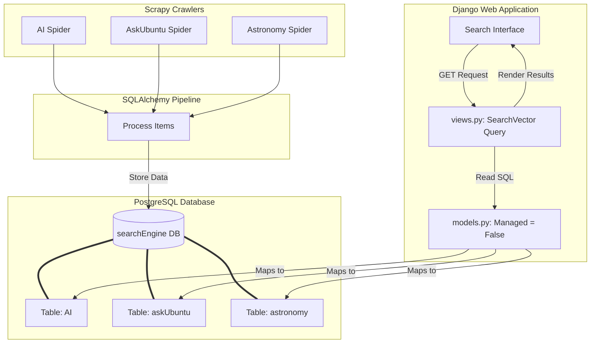

# StackOverflow Search Engine Project


**2016 B.Tech CSE StackOverflow Search Engine project** — A full-stack, cloud-ready search engine application developed to scrape, index, and query questions from various StackExchange forums (specifically Artificial Intelligence, askUbuntu, and Astronomy).

The project is structured into two main phases:
1. **Data Ingestion (Crawlers)**: Built using Scrapy, BeautifulSoup4, and SQLAlchemy to crawl StackExchange sites and store questions, tags, links, and stats in a PostgreSQL database.
2. **Search Application (Engine)**: Built using Django to provide a web-based search interface, leveraging PostgreSQL fulltext search features (`SearchVector`) to query the scraped data.

---

## Project Structure

```text
stackoverflow-search-engine-project/
├── crawlers/
│   ├── crawlers/
│   │   ├── spiders/
│   │   │   ├── __init__.py
│   │   │   ├── ai_spider.py        # Spider for ai.stackexchange.com
│   │   │   ├── astronomy_spider.py # Spider for astronomy.stackexchange.com
│   │   │   └── ubuntu_spider.py    # Spider for askubuntu.com
│   │   ├── __init__.py
│   │   ├── DBmodel.py              # Consolidated SQLAlchemy schemas (AI, askUbuntu, astronomy tables)
│   │   ├── items.py                # Single StackExchangeItem definition
│   │   ├── pipelines.py            # Unified pipeline routing parsed items to correct DB tables
│   │   └── settings.py             # Scrapy settings and DB credentials
│   └── scrapy.cfg                  # Scrapy project configuration
├── engine/                         # Django application root
│   ├── SearchEngine/               # Django settings project
│   │   ├── __init__.py
│   │   ├── settings.py             # Django settings (references database 'searchEngine')
│   │   ├── urls.py                 # Root URL router
│   │   └── wsgi.py
│   ├── search_app/                 # Django search app
│   │   ├── __init__.py
│   │   ├── admin.py
│   │   ├── apps.py
│   │   ├── form.py                 # Cleaned SearchForm
│   │   ├── models.py               # Django model representations of database tables
│   │   ├── urls.py                 # App URL routing
│   │   ├── views.py                # Postgres SearchVector query logic
│   │   └── templates/
│   │       └── search_app/
│   │           ├── search.html     # Main search page
│   │           └── search_results.html # Search results page
│   └── manage.py                   # Django CLI tool
├── data/                           # Centralized data folder for CSV dumps
│   ├── ai.csv
│   ├── askUbuntu.csv
│   └── astronomy.csv
├── .gitignore
└── requirements.txt
```

---

## Architecture Flow



---

## Prerequisites & Installation

### 1. Requirements
Ensure you have the following installed on your machine:
- **Python 3.8+**
- **PostgreSQL** database service (running locally or remotely)
- **libpq-dev** (required for `psycopg2` on Linux/Ubuntu)

### 2. Environment Setup
Clone the repository, navigate to the search engine project directory, create a virtual environment, and install dependencies:

```bash
cd stackoverflow-search-engine-project
python3 -m venv venv
source venv/bin/activate
pip install -r requirements.txt
```

---

## Database Setup

Both the Django engine and Scrapy crawlers connect to a PostgreSQL database named `searchEngine`.

1. **Start PostgreSQL service** and log into the shell:
   ```bash
   sudo service postgresql start
   sudo -u postgres psql
   ```

2. **Create the database and user** (matching the default settings):
   ```sql
   CREATE DATABASE "searchEngine";
   CREATE USER mayank WITH PASSWORD '12345';
   GRANT ALL PRIVILEGES ON DATABASE "searchEngine" TO mayank;
   ALTER DATABASE "searchEngine" OWNER TO mayank;
   \q
   ```
   *Note: If your local PostgreSQL credentials differ, make sure to update them in the Scrapy settings `crawlers/crawlers/settings.py` and Django `SearchEngine/settings.py`.*

---

## Running the Crawlers

The spiders crawl StackExchange, extract questions, tags, links, and vote counts, and write them directly to the database via SQLAlchemy pipelines. Running a crawler automatically generates its database table.

Execute the following commands from the `crawlers/` directory:

1. **AI Crawler**:
   ```bash
   cd crawlers
   scrapy crawl ai_spider
   ```

2. **AskUbuntu Crawler**:
   ```bash
   cd crawlers
   scrapy crawl ubuntu
   ```

3. **Astronomy Crawler**:
   ```bash
   cd crawlers
   scrapy crawl astro
   ```

---

## Running the Search Engine

Once data is crawled and populated into the database, you can run the Django search engine:

1. Navigate to the Django root directory:
   ```bash
   cd engine
   ```

2. Apply migrations (if any are pending for Django's internal tables like admin/sessions):
   ```bash
   python manage.py migrate
   ```

3. Start the development server:
   ```bash
   python manage.py runserver
   ```

4. Open your browser and navigate to `http://127.0.0.1:8000/engine/` to access the search portal. Select the target site (AI, askUbuntu, or Astronomy) and enter your query.

---

## Technical Details

### Unified Crawler Pipeline
The Scrapy crawlers use a unified `StackExchangePipeline` that routes scraped items to the correct database table using separate SQLAlchemy models based on the running spider's name:
```python
class StackExchangePipeline(object):
    def __init__(self):
        engine = db_connect()
        create_tables(engine)
        self.Session = sessionmaker(bind=engine)

    def process_item(self, item, spider):
        session = self.Session()
        if spider.name == 'ai_spider':
            db_item = AIDB(**item)
        elif spider.name == 'ubuntu':
            db_item = AskUbuntuDB(**item)
        elif spider.name == 'astro':
            db_item = AstronomyDB(**item)
        # Commit logic...
```

### Fulltext Search in Django
To query the database efficiently, Django utilizes its `django.contrib.postgres.search` module. In `views.py`, the search query uses `SearchVector` to run vector-based text queries over the text fields:
```python
astronomyObj = Astronomy.objects.annotate(
    search=SearchVector('questions')
).filter(search=query)
```
This enables Postgres-native stemming and ranking for highly relevant query results.
